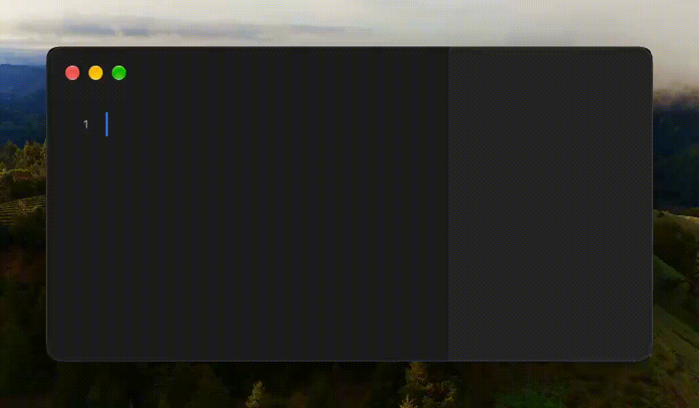

<p align="center">
  
</p>

<h1 align="center">Numlex</h1>

<p align="center">
  <a href="https://www.apple.com/macos/"></a>
  <a href="https://www.swift.org"></a>
  <a href="https://github.com/Qulierm/Numlex/releases/latest"></a>
  <a href="LICENSE"></a>
  <a href="https://github.com/Qulierm/homebrew-tap"></a>
  <a href="https://www.producthunt.com/products/numlex"></a>
  <a href="https://alternativeto.net/software/numlex/about/"></a>
</p>

<p align="center">
  A notepad calculator: type plain lines, get live, checked results — natural math,
  variables, percentages, dates, unit and currency conversions, and reusable
  live answer tokens.
</p>

<p align="center">
  <a href="https://github.com/Qulierm/Numlex/releases/latest">Download the latest release</a>
</p>

<p align="center">
  <a href="Assets/NumlexScreenshot.png">
    
  </a>
</p>

## Features

<table>
  <tr>
    <th>Variables &amp; Functions</th>
    <th>Natural Calculations</th>
  </tr>
  <tr>
    <td align="center"><a href="Assets/Demos/base.gif"></a></td>
    <td align="center"><a href="Assets/Demos/household.gif"></a></td>
  </tr>
  <tr>
    <td align="center"><em>Name values, apply functions, and totals stay live</em></td>
    <td align="center"><em>Arithmetic, percentages, section totals and dates — as plain lines</em></td>
  </tr>
  <tr>
    <th>Units &amp; Currencies</th>
    <th>Linked Answers</th>
  </tr>
  <tr>
    <td align="center"><a href="Assets/Demos/kilometres.gif"></a></td>
    <td align="center"><a href="Assets/Demos/linked.gif"></a></td>
  </tr>
  <tr>
    <td align="center"><em>Convert distance, temperature, mass and currency in one line</em></td>
    <td align="center"><em>Reuse any result as a bubble that stays in sync</em></td>
  </tr>
</table>

## Natural calculations

For the full, exhaustive reference of every construct — line forms, operators,
functions, bases, percentages, money, units, currencies, dates, network
queries, number presentation — see the
[docs/SYNTAX_REFERENCE.md](docs/SYNTAX_REFERENCE.md) canonical reference (documents
current `main`) and the [documentation index](docs/README.md) for the settings and
appearance guide, [docs/EXPORT_AND_PRINT.md](docs/EXPORT_AND_PRINT.md) for PDF
export and printing, and [docs/UPDATES.md](docs/UPDATES.md) for the secure in-app
update model. The published documentation lives at <https://numlex.tech/docs/>.

Numlex reads ordinary notebook text — no formula syntax, no cell references. Each line
is evaluated strictly; anything it cannot parse stays quiet instead of guessing.

```text
hotel = 1240          1,240
hotel + 10%           1,364
$240 + 10% tip        $264.00
sqrt(144)             12
room = 180 × 4        720
round(room / 3, 2)    240
sum(1, 2, 3)          6
20 km to meter        20,000 m
100 C to F            212 F°
Jan 10 + 12 days      Jan 22
```

Every line above runs through the real engine — these are its exact, deterministic
outputs, with no live rates involved. Declare values with `name = expression`, use
percentages and money with the same grammar (`$240 + 10% tip`), and do date arithmetic
on plain month names (`Jan 10 + 12 days`). Named money reads naturally too:
`apple = 5$` prices one apple, and `2 apples + 3 apples` totals in dollars.

Currency codes are case-insensitive: `500 usd`, `500 UsD` and `500 USD` all mean
500 US dollars (`usd`, `eur`, `gbp`, … — any of the 166 supported ISO codes). A
line may combine currencies with `+` and `-`: the **first** money operand sets the
result currency and every other operand is converted into it with the current
rates, so with 1 EUR = 1.1 USD `500 usd - 300 eur` is `$227.27`. Symbols and codes
mix freely (`$500 - 300 eur`, `500 usd - €300`), and plain scalars or percentages
keep their meaning (`500 usd - 20` = `$480.00`, `500 usd - 10%` = `$450.00`).
Currency × currency and currency ÷ currency stay errors (never a silent `USD²`),
money × scalar and money ÷ scalar still work, and physical units still never
convert implicitly. If the needed rate pair is missing, the answer is the explicit
`Rates unavailable` state — never a guessed number, a partial sum or a stale rate.
The same rules apply to named values and to answer tokens:
`balance = 500 usd - 300 eur` stores US dollars, and `TOKEN - 300 eur` converts
into the token's currency. Constants are offline, so a single-currency constant
(`Rent = 500 usd`) resolves normally while a mixed-currency constant stays inactive.

### Built-in math functions

The engine shares one pure function registry across every scalar path — free
expressions, assignments, constants and unitless answer tokens. Names are
case-insensitive, arguments are full expressions (nesting included), and a
function-shaped line is strict: an unknown name, a bad arity, a bad comma or a
domain failure is a precise error, never a guess.

- `sqrt`, `abs`, `round(x)` / `round(x, d)` (ties round away from zero)
- `min`, `max`, `sum`, `average` — variadic, one or more arguments
- `pow(b, e)` — same finite contract as the `^` operator
- `ln(x)`, `log(x)` (base 10), `log(x, b)`, `log10(x)`
- `sin`, `cos`, `tan` — radians; `asin`, `acos`, `atan`
- `radians(d)` and `degrees(r)` — explicit unit helpers
- `int(x)`, `bin(x)`, `oct(x)`, `hex(x)` — exact integer projection with its own
  presentation radix (`hex(255)` → `0xFF`)
- `count`, `median`, `stdev` (sample, n−1) — variadic statistics
- `rand(lo, hi)` — a uniform random integer in the inclusive range (dynamic per epoch)

Inside argument lists a comma separates arguments; a comma directly before exactly
three digits is still a thousand separator, so `sum(1, 234)` is two arguments while
`sum(1,234)` is one grouped literal — and `1,234,567` outside a call is one number,
exactly as before. Built-ins activate only in call position: a variable or constant
named `sum` still works in `sum + 1`, and `sum(1, 2)` calls the function.
Answer tokens join the same engine when they are unitless: `sqrt(<token>)` and
`<token> ^ 2` evaluate with the token as a live argument, while unit-bearing and
money tokens passed to a function or to `^` fail safely instead of losing their
unit.

### Section totals

A standalone `total` line sums the unitless calculation answers above it — since
the sheet start or the previous `total` — and starts a fresh section below.
The answer renders semibold under a gray rule placed exactly between the
neighboring answers, and it behaves like any other answer: Copy, per-answer
rounding and tokens all work, and wrapped logical lines keep their gutter
number centered on the block. Money, unit-bearing quantities, booleans, dates
and error rows never enter a section `total`.

The window also has a persistent bottom Total panel (turn it off under
Settings → General → Show total bar). It is a separate, dimension-agnostic
contract: it adds the evaluated magnitude of every ordinary scalar answer row
once — unitless numbers, unit-bearing quantities (`2 kg`), money (`$3`),
named scalars and exact integers — and shows one plain unitless number with no
unit conversion, no FX normalization and no unit or currency suffix
(`2 kg`, `$3` and `4 EUR` total `9`). Derived aggregate rows (inline `total`,
`subtotal`, `grand total` and tag aggregates) are excluded so the totals never
double-count, and booleans, dates, locations/DMS, error and blank rows do not
contribute. Per-answer rounding and number-format overrides
never change the bottom Total; it follows the global notation and regional
settings.

## Conversions

Write `10 km to meter` — `in` works just as well (`10 km in meter`).

- Around 290 measurement units across length, area, volume, mass, time, speed,
  pressure, force, torque, energy, power, flow and viscosity, plus temperature and
  fuel economy.
- 166 fiat currencies with live rates: codes (`10 EUR to USD`), symbol forms
  (`$100 in EUR`) and English names (`10 Indian rupees to Japanese yen`).
- Rates are cached locally for an hour; if the network is unavailable, Numlex keeps
  serving the last good table.

Type `weather in London` for the current 2 m temperature in Celsius degrees
(shown `C°`). The lookup goes to Open-Meteo with no key and no location
permission — only the city you typed is ever sent. Readings are cached for ten
minutes, and the last good value keeps showing if the next refresh fails, so a
flaky connection never blanks your sheet. The city name is tinted exactly like
any other unit, in Light, Dark and custom styling alike.

## Dates and times

The temporal subsystem (shipped in 4.9.0) turns the notebook into a small
time-aware calculator: calendar arithmetic,
clock math, timezones, timestamps, durations, timecode, work calendars and
special dates all read as ordinary lines.

```text
May 5, 2026 + 30 days        Jun 4, 2026
3:30pm + 2 hours 15 minutes  5:45 pm
2am PST to GMT               10:00 am
April 1, 2019 3:30pm as iso8601  2019-04-01T15:30:00+02:00
5.5 minutes as timespan      5 min 30 s
03:10:20:05 at 30 fps + 50 frames  03:10:21:25
workdays from April 12 to June 15  44 workdays
days until Christmas          344 days
```

Timezone conversion (`time in Paris`, `6pm Sydney in Chicago`) runs on a
bundled, hash-verified offline catalog; work calendars use 25-country public
holiday data for 2019–2035 and can be configured under Settings → Dates & Times
(hours per workday, holiday region, custom timezone aliases). Unsupported
regions, years or invalid dates fail closed with an exact error rather than
guessing; time, timestamp and timecode rows are excluded from totals and are
not tokenizable. See the [canonical syntax reference](docs/SYNTAX_REFERENCE.md)
for the strict forms and every lane.

## Money and finance

Finance phrases (shipped in 4.9.0) build on the same money grammar and strict
lane discipline:

```text
$1,000 after 3 years at 7%                      $1,225.04
$1,000 for 3 years at 7% compounding monthly    $1,232.93
monthly repayment on $10,000 over 6 years at 6%  $165.73
annual return on $1,000 invested $2,500 returned after 7 years  13.99%
$300 + VAT                                      $345.00
income tax on $75,000 in US                     $8,114.00
what is $1,000 from 1990                        $2,537.53
```

Compound interest, present value, ROI and CAGR, loan/mortgage payments and
interest, sales tax/VAT/GST, estimated 2026 income tax for 10 countries and BLS
CPI-U inflation (1913–2025 plus a provisional 2026 point and an explicit-rate
future form) all resolve offline from versioned, hash-verified catalogs. Sales
tax uses the region preset you configure under Settings → General → Tax (with a
documented unset-versus-zero distinction); income tax is a coarse national
estimate with per-country provenance and fail-closed rules, not tax advice, and
inflation answers are deterministic for the bundled data snapshot. Missing
rates stay the explicit `Rates unavailable` state. See the
[canonical syntax reference](docs/SYNTAX_REFERENCE.md).

## Answer tokens

Double-click any answer — or type an operator on a new line — and Numlex inserts a
live token at the caret or selection. A token is a small bubble that always displays
the current value of its source line: change the source and the bubble updates
immediately. Several distinct bubbles may reuse the same earlier line — each keeps its
own identity and follows the live value, as in the screenshot above. If a source line
stops evaluating, its tokens stay in place and show the remembered `Line N` label
instead of a stale number.

## Answer menu

Right-click (or Control-click) any answer for its native menu: **Copy Answer** puts
the exact displayed value on the clipboard; the discrete **0…10 dp** slider
re-rounds just that answer without touching the source line; **Delete Line**
removes the source line. The menu is fully native, so it follows the system
appearance in Light and Dark.

## Sheets and folders

Work in named sheets with line numbers, syntax tinting and a live results column.
Sheets are grouped by the one-level folder tabs pinned to the bottom of the sidebar:
the built-in **General** tab plus any custom folders you create. Selecting a tab
filters the sheet list only — your editor and cursor never jump. The main window
resizes down to a 260pt content height for compact desks; the default stays
800×600 and the sidebar and answers keep scrolling safely. The answer column is
adjustable (140–400 pt, default 200): drag the thin divider between the editor
and the answers — left grows the column, right shrinks it — or set an exact
width in Settings → Styling → Answer column. The choice is app-global (it is
never part of a sheet's `.nlx`), and in a narrow window the column is capped so
the editor always keeps at least 280 pt.

## Styling and constants

Choose Auto (follow macOS), Light or Dark for the whole app, pick the
Dock/App Switcher icon (Dark — the signed bundle icon and the default — or
Light), then tune font size, font design, role colors and the answer column
width, decimal places, input
helpers, line numbers, interface language, the currency display, and an option
to hide the sidebar button once collapsed —
reopen it any time with ⌃⌘S (Control-Command-S) or View > Toggle Sidebar. Define up to 100 app-wide constants (`PI = 3.141592653589793`,
`Sales Tax = 20%`, `Side = sqrt(4)`) that are available in every sheet and resolved
live through the same strict engine — function arguments included.
See [docs/SETTINGS_AND_APPEARANCE.md](docs/SETTINGS_AND_APPEARANCE.md) for the full
settings reference: **seven** icon-over-label tiles across the top of the window
(General, Editing, Numbers, Dates & Times, Constants & Units, Styling, About)
with one focused page each — language, appearance, the application icon and the
sales-tax configuration live together in General, Dates & Times owns the work
calendar and custom timezone aliases, and About carries the app identity plus the
update controls. The floating Total's statistic (Sum, Average, Count or Median)
is a native checked context menu, persisted app-globally and never part of `.nlx`.

## First launch

A genuinely new install opens on a short, native **calculation bloom**: ten real
calculations in the app's own editor palette stream into two airy columns around
the app icon, gather into it and disappear, and the icon answers with a one-shot
**silver splash** (fine monochrome rays, a soft expanding wave and a few
droplets). The splash settles into a compact final lockup: the icon grows from
its streaming footprint to a large 152 pt frame, the official slogan
*Think freely. We’ll do the math.* fades in beneath it in the same neutral tone,
and a single monochrome **Get Started** button — silver on Dark, graphite on
Light, matching the icon rather than the accent colour — appears last. The
slogan itself is a two-line monochrome lockup (a rounded clause answered by an
italic serif, then a quieter rounded line answered by a compact monospaced
one), revealed as one calm block. The whole
sequence runs once for roughly two and a half seconds and stops; with **Reduce
Motion** the large icon, slogan and button are simply there, immediately usable,
with no staged animation at all.

Pressing Get Started records a small versioned marker (`welcome-v1`) in the
app's data directory (separate from your settings and sheets), mounts the
notebook underneath and then slides the welcome panel up out of the content
bounds like a curtain over 0.75 s — the window itself never moves, resizes or
loses its titlebar. The notebook, its sidebar and TextKit are not created behind
the welcome, and focus lands in the editor only after the curtain has cleared.

Existing installs never see the bloom: any prior artifact — the store (even
corrupt or unreadable), the currency-rate cache, the weather cache or the
location cache — counts as an existing install, and in that case the completion
marker is recorded best-effort without touching those files. Closing the window
before pressing Get Started leaves no marker, so the bloom returns next launch.
Your Light/Dark/Auto choice and app icon are never changed by any of this.

## Tags, subtotals and statistics

Package 7 adds a plain-text structure on top of the notebook: a trailing `#tag`
marks a row for `total of #tag` / `average of #tag` / `count of #tag` /
`median of #tag` aggregates; an exact `---` divider starts a new section;
`subtotal` (± a percentage, optionally named) sums the section and
`grand total` sums the successful subtotals. Four new functions join the
registry — `count`, `median`, `stdev` (sample) and `rand` — alongside the
natural forms `median of …`, `count of …`, `standard deviation of …` and
`random number between X and Y`. Random values are stable for the current
epoch and reroll only on a semantic edit or the explicit ⌘R (Recalculate
Dynamic Values); they are never tokenizable. Right-click the floating Total to
switch it between Sum, Average, Count and Median.

## Files and storage

Sheets persist locally in Application Support. The only network traffic is the
background rates refresh plus Open-Meteo lookups for `weather in …` lines you
type yourself — never GPS or location data. From the File menu, import or export
any sheet as a `.nlx` file, export it as a PDF, or print it (⌘P). Drag a sheet
onto a folder tab to re-file it.

## PDF export and printing

The File menu owns exactly four sheet commands: **Import Sheet…** (⌘I),
**Export Sheet (.nlx)…** (⌘E), **Export Sheet as PDF…** and **Print…** (⌘P).
PDF export and printing open one options sheet — font family, face and size,
syntax highlighting, original line numbers, footer Total, comment/`#`-marker
filters and an inclusive line range — and every option is session-only and
clamped to the selected sheet. Both draw one immutable resolved snapshot through
one deterministic paginated renderer: the live editor, caret, selection,
highlights and tokens are never touched, answer tokens keep their real capsule
labels, the exported footer uses the current footer statistic over the exported
rows only, writes are atomic, and the whole path is fully offline. See
[docs/EXPORT_AND_PRINT.md](docs/EXPORT_AND_PRINT.md) for the complete contract.

## Download

- macOS 26 or later, Apple Silicon (arm64).
- 4.9.3 is the current release. 4.8.0 was the first release with secure in-app
  updates, so anyone on 4.8.0 or later (including 4.8.0 itself) can check,
  verify and install later versions in the app; users still on 4.7.0 or earlier
  have no updater and install the current release manually once, then update
  in-app. See [docs/UPDATES.md](docs/UPDATES.md).
- Download the `.dmg` from the [latest release](https://github.com/Qulierm/Numlex/releases/latest),
  open the plain (unstyled) disk image — it contains only **Numlex.app** and an
  **Applications** shortcut — and drag **Numlex.app** into Applications.
- Numlex is ad-hoc signed and **not notarized**. On first launch, Control-click (or
  right-click) **Numlex.app**, choose **Open**, and confirm the prompt.
- Verify your download with the checksums file from the same release:

```sh
shasum -a 256 -c SHA256SUMS
```

### Homebrew

You can also install Numlex from the project's own custom tap:

```sh
brew install --cask Qulierm/tap/numlex
```

This uses the project's custom [Qulierm/tap](https://github.com/Qulierm/homebrew-tap),
not the official Homebrew cask repo. Numlex is ad-hoc signed and **not notarized**,
so on first launch you still have to Control-click (or right-click) **Numlex.app**,
choose **Open**, and confirm the prompt.

## Build from source

Requires macOS 26 with the Swift 6.2 toolchain; Xcode Command Line Tools are enough
(`xcode-select --install`).

```sh
swift build               # debug
swift build -c release    # release
```

The engine suite covers 1,305 shared cases, runnable two ways:

```sh
swift test                # Swift Testing suite (full Xcode toolchain)
swift run NumlexTests     # standalone runner (Command Line Tools only)
```

Package a signed app bundle:

```sh
Scripts/build-app.sh [debug|release]   # produces .build/Numlex.app
```

### Packaging and offline resources

The five offline catalogs (timezones, holidays, income tax, CPI, tax
presets) ship inside the app as one SwiftPM resource bundle at the
STANDARD location `Numlex.app/Contents/Resources/Numlex_NumlexCore.bundle`.
`Scripts/build-app.sh` takes that bundle from the exact bin path of the
requested configuration and fails closed on any missing dataset, so the
packaged app is fully self-contained and relocatable.

At runtime the catalogs resolve through the centralized `ResourceLocator`
(`Sources/NumlexCore/Models/ResourceLocator.swift`) in a fixed order:
standard packaged location first, then the SwiftPM-style layouts a
`swift build` / `swift run` / test process uses, then the current
directory. It never touches the SwiftPM-generated resource accessor (whose
hardcoded developer build path and trap made older packaged builds crash on
first launch when installed outside the original build directory) and
contains no developer-absolute path. A missing or corrupt dataset is a
`nil` catalog — fail closed, never a crash.

Deterministic packaging checks (no GUI required):

```sh
Scripts/relocated-app-smoke.sh   # copies the app OUTSIDE the repo and proves the copy loads all five catalogs via --validate-packaged-resources
Scripts/validate-dmg.sh <dmg>    # plain-DMG contract incl. the standard bundle location and no root-level bundles
```

<details>
<summary>Architecture</summary>

- **Native UI** — SwiftUI on top of TextKit (`NSTextView`) with line numbers, syntax
  tinting and per-line answer alignment. No web view and no scripting engine —
  expressions run through the pure Swift parser.
- **`Sources/NumlexCore`** — a pure, deterministic parser: tokenizer,
  recursive-descent expression parser, unit catalog, currency presentation, date
  arithmetic and the live reference-token resolver. Strict errors instead of silent
  coercion.
- **Persistence** — one JSON store in `~/Library/Application Support/Numlex`; `.nlx`
  import/export per sheet, PDF export and printing from one frozen snapshot.
- **Rates** — fetched from `open.er-api.com`, cached for one hour with an 8-second
  timeout; the last good table keeps serving when offline.

</details>

## License

Numlex is available under the [MIT License](LICENSE).
