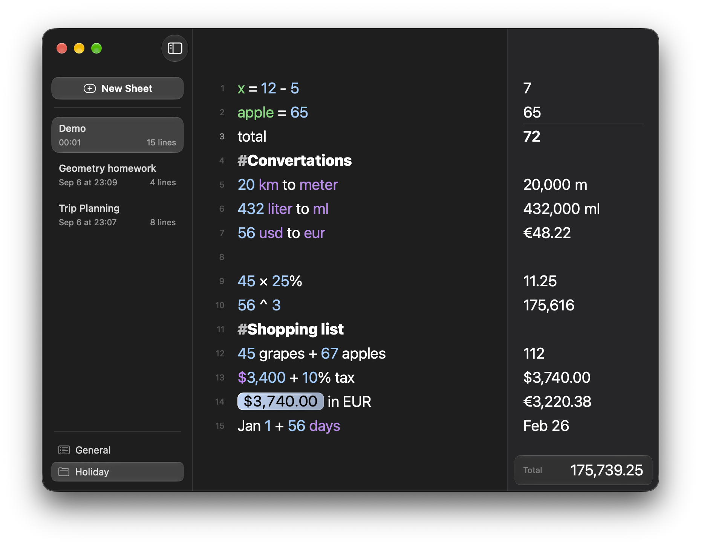

<p align="center">
  
</p>

<h1 align="center">Numlex</h1>
<p align="center">
  
</p>

A simple and elegant notepad-based calculator to create and manage sheets with real-time evaluation of mathematical expressions.

## Download

Get the latest release from the [GitHub releases page](https://github.com/Qulierm/Numlex/releases/latest).

- macOS 26 or later, Apple Silicon (arm64).
- The current release is ad-hoc signed and not notarized. On the first launch, Control-click (or right-click) `Numlex.app` and choose **Open** to bypass the Gatekeeper warning.

## Architecture

Numlex is a native **Swift 6 / SwiftUI** macOS app (macOS 26, Liquid Glass). The calculation engine is a pure, evaluation-free domain parser in `Sources/NumlexCore` — no scripting, no web view.

- `Sources/NumlexCore/Engine/` — tokenizer, parser and evaluator. Grammar: parentheses, decimal numbers, unary `+`/`-`, `+ - * / ^ %` (postfix percent), variables and `name = expression` assignments, headings (`// Title`), `#` notes. Strict errors instead of silent coercion; rounding respects settings.
- `Sources/NumlexCore/Engine/Conversions.swift` — unit conversions (`10 km to meter`, `100 C to F`, …) and fiat-currency conversion (166 live codes, `10 EUR in USD`, `$100 to EUR`, `10 rupees in yen`) via `Rates`.
- `Sources/NumlexCore/Engine/CurrencyPresentation.swift` — the ONE currency marker table: input markers (`$`, `€`, `Rp`, `zł`, `Kč`, `CN¥`, …), output symbols and ISO-4217 minor digits, shared by every parser path.
- `Sources/NumlexCore/Engine/ConstantResolver.swift` — the pure resolver for user constants: name validation, reserved names, case/whitespace duplicates, topological dependency resolution with cycle detection and strict expression evaluation (money values keep their single ISO code; no unit stripping, no word fallback).
- `Sources/NumlexCore/Services/` — JSON persistence in Application Support, live rates from the open.er-api.com endpoint (cached 1 h, 8 s timeout, offline-safe).
- `Sources/NumlexCore/Localization.swift` — interface translations (en/ru/de/it/fr/ch).
- `Sources/NumlexApp/` — SwiftUI app: sidebar with sheet management (create, rename, delete, import/export `.nlx`), native `NSTextView` notebook editor with line numbers and syntax tinting, live results column with row alignment, settings scene (language, font size, line spacing, decimal places, rates).

## Supported conversions

`<number> <unit> to <unit>` (or `in`): temperature, fuel economy (`km/L`, `US mpg`, `L/100km`, `mi/L`, `gal/100mi` — reciprocal crossings are exact), and ~290 measurement units across length (incl. hand, furlong, US survey foot, angstrom, pica), area, volume (incl. bbl, bushel, metric cup), mass (incl. slug, troy oz, cwt), time (Gregorian average `yr`/`mo`, common/Julian year), speed (knot, Mach, `c₀`), pressure (at, psf, mmH2O), force (ozf, kip, poundal), torque (N·cm, ozf·in), energy (erg, t TNT, quad, hph), power (TR, boiler/electric hp), flow (cfm, UK gpm, US mgd) and viscosity (Pa·s, cP, St, reyn).

Currency: 166 fiat codes with live rates (crypto and precious metals are out of scope). Codes (`10 EUR to USD`), safe output symbols (`Rp25000`, `zł100`, `2.5K$`, `₩500`) and English names for the major currencies (`10 Indian rupees to Japanese yen`) all work in the conversion grammar; display uses the shared presentation (`$600.00`, ISO-code fallback, ISO-4217 minor digits — 0 for JPY/KRW/VND/CLP/…, 3 for BHD/KWD/…, 4 for CLF).

## Custom constants

Settings → **Constants**: up to 100 user-defined named values (`PI = 3.141592653589793`, `Sales Tax = 20%`, `Monthly Rent = $2,500`) available in EVERY sheet. Names are 1–6 words (case/whitespace-insensitive), may reference each other in any order (cycles are detected per row), and evaluate with the strict engine — no unit stripping, no word fallback. Constants are immutable: `PI = 3` shows a `Cannot assign to constant` error in every sheet, token route included. They persist with the app settings (never embedded in `.nlx` exports), paint green in the editor, and feed the live-result pipeline: sheet evaluation, answer tokens, previous-answer insertion, auto-titling and syntax highlighting all resolve them through the same pure resolver.

## Prerequisites

- macOS 26 with Xcode Command Line Tools (`xcode-select --install`)
- Swift 6 toolchain

## Build

```sh
swift build            # debug
swift build -c release # release
```

## Tests

The engine test suite is registered with Swift Testing (`Tests/NumlexCoreTests`) and shares all 436 cases with a standalone runner (`Tests/NumlexTestKit`).

```sh
swift test             # Swift Testing suite (full Xcode toolchain)
swift run NumlexTests  # standalone runner — works with Command Line Tools only
```

## Package a .app bundle

```sh
Scripts/build-app.sh [debug|release]
```

Produces `.build/Numlex.app` (signed with an ad-hoc identity) and prints its path.
