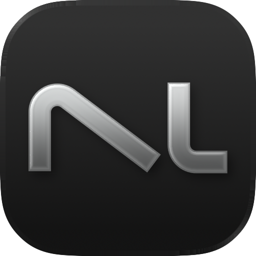

<p align="center">
  
</p>

<h1 align="center">Numlex</h1>

<p align="center">
  <a href="https://www.apple.com/macos/"></a>
  <a href="https://www.swift.org"></a>
  <a href="https://github.com/Qulierm/Numlex/releases/latest"></a>
  <a href="LICENSE"></a>
  <a href="https://github.com/Qulierm/homebrew-tap"></a>
  <a href="https://www.producthunt.com/products/numlex"></a>
  <a href="https://alternativeto.net/software/numlex/about/"></a>
</p>

<p align="center">
  A notepad calculator: type plain lines, get live, checked results — natural math,
  variables, percentages, dates, unit and currency conversions, and reusable
  live answer tokens.
</p>

<p align="center">
  <a href="https://github.com/Qulierm/Numlex/releases/latest">Download the latest release</a>
</p>

<p align="center">
  
</p>

## Natural calculations

Numlex reads ordinary notebook text — no formula syntax, no cell references. Each line
is evaluated strictly; anything it cannot parse stays quiet instead of guessing.

```text
hotel = 1240          1,240
hotel + 10%           1,364
$240 + 10% tip        $264.00
sqrt(144)             12
room = 180 × 4        720
round(room / 3, 2)    240
sum(1, 2, 3)          6
20 km to meter        20,000 m
100 C to F            212 F°
Jan 10 + 12 days      Jan 22
```

Every line above runs through the real engine — these are its exact, deterministic
outputs, with no live rates involved. Declare values with `name = expression`, use
percentages and money with the same grammar (`$240 + 10% tip`), and do date arithmetic
on plain month names (`Jan 10 + 12 days`). Named money reads naturally too:
`apple = 5$` prices one apple, and `2 apples + 3 apples` totals in dollars.

### Built-in math functions

The engine shares one pure function registry across every scalar path — free
expressions, assignments, constants and unitless answer tokens. Names are
case-insensitive, arguments are full expressions (nesting included), and a
function-shaped line is strict: an unknown name, a bad arity, a bad comma or a
domain failure is a precise error, never a guess.

- `sqrt`, `abs`, `round(x)` / `round(x, d)` (ties round away from zero)
- `min`, `max`, `sum`, `average` — variadic, one or more arguments
- `pow(b, e)` — same finite contract as the `^` operator
- `ln(x)`, `log(x)` (base 10), `log(x, b)`, `log10(x)`
- `sin`, `cos`, `tan` — radians; `asin`, `acos`, `atan`
- `radians(d)` and `degrees(r)` — explicit unit helpers

Inside argument lists a comma separates arguments; a comma directly before exactly
three digits is still a thousand separator, so `sum(1, 234)` is two arguments while
`sum(1,234)` is one grouped literal — and `1,234,567` outside a call is one number,
exactly as before. Built-ins activate only in call position: a variable or constant
named `sum` still works in `sum + 1`, and `sum(1, 2)` calls the function.
Answer tokens join the same engine when they are unitless: `sqrt(<token>)` and
`<token> ^ 2` evaluate with the token as a live argument, while unit-bearing and
money tokens passed to a function or to `^` fail safely instead of losing their
unit.

### Section totals

A standalone `total` line sums the unitless calculation answers above it — since
the sheet start or the previous `total` — and starts a fresh section below.
The answer renders semibold under a gray rule placed exactly between the
neighboring answers, and it behaves like any other answer: Copy, per-answer
rounding and tokens all work, and wrapped logical lines keep their gutter
number centered on the block.

## Conversions

Write `10 km to meter` — `in` works just as well (`10 km in meter`).

- Around 290 measurement units across length, area, volume, mass, time, speed,
  pressure, force, torque, energy, power, flow and viscosity, plus temperature and
  fuel economy.
- 166 fiat currencies with live rates: codes (`10 EUR to USD`), symbol forms
  (`$100 in EUR`) and English names (`10 Indian rupees to Japanese yen`).
- Rates are cached locally for an hour; if the network is unavailable, Numlex keeps
  serving the last good table.

Type `weather in London` for the current 2 m temperature in Celsius degrees
(shown `C°`). The lookup goes to Open-Meteo with no key and no location
permission — only the city you typed is ever sent. Readings are cached for ten
minutes, and the last good value keeps showing if the next refresh fails, so a
flaky connection never blanks your sheet. The city name is tinted exactly like
any other unit, in Light, Dark and custom styling alike.

## Answer tokens

Double-click any answer — or type an operator on a new line — and Numlex inserts a
live token at the caret or selection. A token is a small bubble that always displays
the current value of its source line: change the source and the bubble updates
immediately. Several distinct bubbles may reuse the same earlier line — each keeps its
own identity and follows the live value, as in the screenshot above. If a source line
stops evaluating, its tokens stay in place and show the remembered `Line N` label
instead of a stale number.

## Answer menu

Right-click (or Control-click) any answer for its native menu: **Copy Answer** puts
the exact displayed value on the clipboard; the discrete **0…10 dp** slider
re-rounds just that answer without touching the source line; **Delete Line**
removes the source line. The menu is fully native, so it follows the system
appearance in Light and Dark.

## Sheets and folders

Work in named sheets with line numbers, syntax tinting and a live results column.
Sheets are grouped by the one-level folder tabs pinned to the bottom of the sidebar:
the built-in **General** tab plus any custom folders you create. Selecting a tab
filters the sheet list only — your editor and cursor never jump. The main window
resizes down to a 260pt content height for compact desks; the default stays
800×600 and the sidebar and answers keep scrolling safely.

## Styling and constants

Choose Light or Dark for the whole app, then tune font size, font design and role
colors, decimal places, input helpers, line numbers, interface language, the
currency display, and an option to hide the sidebar button once collapsed —
reopen it any time with ⌃⌘S (Control-Command-S) or View > Toggle Sidebar. Define up to 100 app-wide constants (`PI = 3.141592653589793`,
`Sales Tax = 20%`, `Side = sqrt(4)`) that are available in every sheet and resolved
live through the same strict engine — function arguments included.

## Files and storage

Sheets persist locally in Application Support. The only network traffic is the
background rates refresh plus Open-Meteo lookups for `weather in …` lines you
type yourself — never GPS or location data. Import and export any sheet as a `.nlx`
file from the File menu, and drag a sheet onto a folder tab to re-file it.

## Download

- macOS 26 or later, Apple Silicon (arm64).
- Download the `.dmg` from the [latest release](https://github.com/Qulierm/Numlex/releases/latest),
  open it, and drag **Numlex.app** into Applications.
- Numlex is ad-hoc signed and **not notarized**. On first launch, Control-click (or
  right-click) **Numlex.app**, choose **Open**, and confirm the prompt.
- Verify your download with the checksums file from the same release:

```sh
shasum -a 256 -c SHA256SUMS
```

### Homebrew

You can also install Numlex from the project's own custom tap:

```sh
brew install --cask Qulierm/tap/numlex
```

This uses the project's custom [Qulierm/tap](https://github.com/Qulierm/homebrew-tap),
not the official Homebrew cask repo. Numlex is ad-hoc signed and **not notarized**,
so on first launch you still have to Control-click (or right-click) **Numlex.app**,
choose **Open**, and confirm the prompt.

## Build from source

Requires macOS 26 with the Swift 6.2 toolchain; Xcode Command Line Tools are enough
(`xcode-select --install`).

```sh
swift build               # debug
swift build -c release    # release
```

The engine suite covers 748 shared cases, runnable two ways:

```sh
swift test                # Swift Testing suite (full Xcode toolchain)
swift run NumlexTests     # standalone runner (Command Line Tools only)
```

Package a signed app bundle:

```sh
Scripts/build-app.sh [debug|release]   # produces .build/Numlex.app
```

<details>
<summary>Architecture</summary>

- **Native UI** — SwiftUI on top of TextKit (`NSTextView`) with line numbers, syntax
  tinting and per-line answer alignment. No web view and no scripting engine —
  expressions run through the pure Swift parser.
- **`Sources/NumlexCore`** — a pure, deterministic parser: tokenizer,
  recursive-descent expression parser, unit catalog, currency presentation, date
  arithmetic and the live reference-token resolver. Strict errors instead of silent
  coercion.
- **Persistence** — one JSON store in `~/Library/Application Support/Numlex`; `.nlx`
  import/export per sheet.
- **Rates** — fetched from `open.er-api.com`, cached for one hour with an 8-second
  timeout; the last good table keeps serving when offline.

</details>

## License

Numlex is available under the [MIT License](LICENSE).
